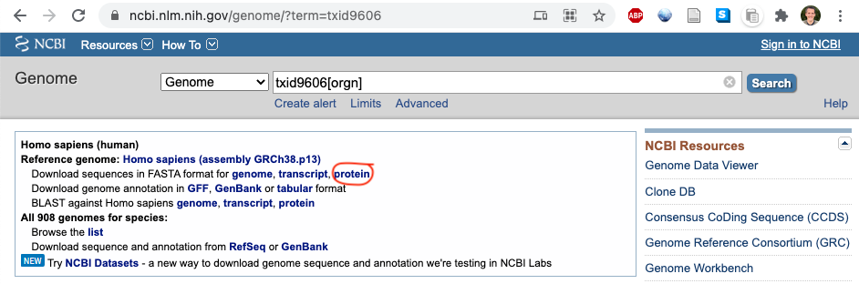

## Environment for ASR in the Harms lab

#### Install necessary software

+ Configure a scientific computing environment in python.  If you have not done so already, I recommend [miniconda](https://docs.conda.io/en/latest/miniconda.html).  Instructions to set up the environment are [here](https://python-for-scientists.readthedocs.io/en/latest/).  You'll need jupyter, numpy, and pandas at a minimum. 

+ Copy contents of this directory to working location.
+ Install [biopython](https://biopython.org/). On a terminal, type `conda install -c bioconda biopython`.
+ Install [muscle](https://www.drive5.com/muscle/). On a terminal, type `conda install -c bioconda muscle`. (This may not work in windows. If it fails, you can download an installer from the linked muscle website). 
+ Install [blast](https://ftp.ncbi.nlm.nih.gov/blast/executables/blast+/LATEST/). On a terminal, type `conda install -c bioconda blast`. (This may not work in windows. If it fails, you can download an installer from the linked ncbi website). 
+ If you're on windows, [install the ubuntu subsystem](https://docs.microsoft.com/en-us/windows/wsl/install-win10).  This will allow you to easy use the bash tools we use in the tutorials. (If you're on macOS or linux, you already have those tools.) 
+ Install [FigTree](http://tree.bio.ed.ac.uk/software/figtree/) for viewing trees.
+ Install [AliView](https://ormbunkar.se/aliview/) for editing alignments. 
+ We'll use [raxml](https://github.com/stamatak/standard-RAxML) to generate our trees and ancestors.  These can be installed locally, however, I would recommend running them on a high-performance computing environment. 

#### Create a local copy of the human proteome for reverse BLASTing

1. In a browser, navigate to: [https://www.ncbi.nlm.nih.gov/genome/?term=txid9606](https://www.ncbi.nlm.nih.gov/genome/?term=txid9606)
2. Click the circled link below to download the human proteome as a zipped file (~20 Mb)



3. Place the file in a working directory. Uncompress it and convert it into a BLAST database. Note, the name of the `.gz` and `.faa` file might be slightly different as the proteome versions on NCBI are continually updated. On the command line, run:

   ```
   gunzip GCF_000001405.39_GRCh38.p13_protein.faa.gz
   makeblastdb -in GCF_000001405.39_GRCh38.p13_protein.faa -dbtype prot -out GRCh38
   ```

   This will create a set of files like `GRCh38.phr` and `GRCh38.pot` in your working directory. If you're pressed for space, you may delete the initial `.faa` file at this point. 

